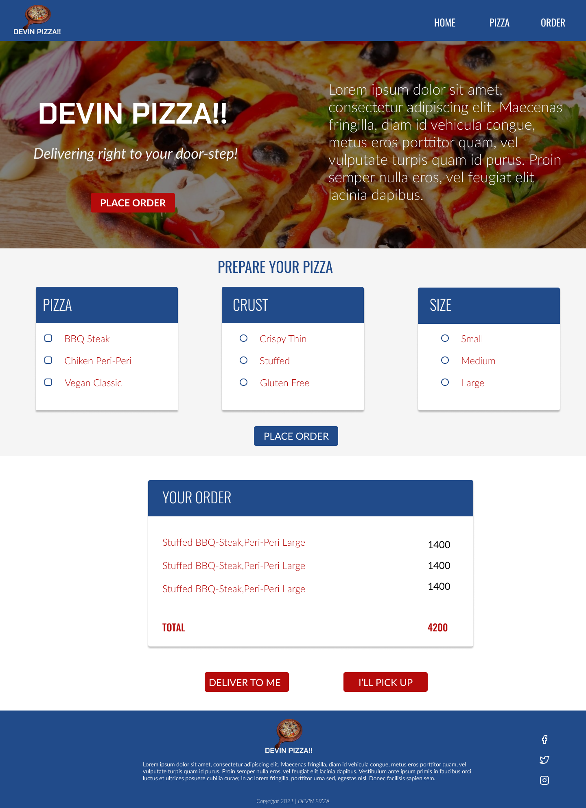

# DEVIN PIZZA!!

#### Devin Pizza is a Pizza selling platform as an effort to reach more clients, July 2021

#### By **Kelvin Gitahi**

## Description

Home to the only HAND MADE pizzas in the region! Made with ingredients sourced locally to ensure freshness and goodness!   <strong>Diet tomorrow. Pizza Today!</strong>.

## Setup/Installation Requirements

- You need a good perfoming computer/laptop: Core i3 or equivalent with high resolution display
- Clone from Github
- Launch index.html file
- All done!
- Easy Peasy😉
- Alternatively, go [here](https://kwathuta.github.io/pizza-store/)

## Known Bugs

There are no known bugs currently but I look forward to improving the overall user experience

## Technologies Used

This site was made entirely using:

- HTML
- CSS
- JavaScript
- jQuery
- Bootstrap

## Support and contact details

I'd love to chat! Ping me on [Twitter](https://twitter.com/kevocb) should any issues arise, or just say Hi!

### License

_MIT Licence_
Copyright &copy; 2021 **Kelvin Gitahi**
